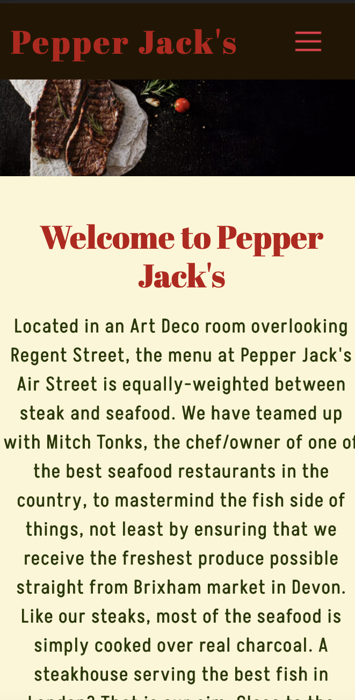

# Pepper Jack's Restaurant

[Live application can be found here](https://pepper-jacks.herokuapp.com/)

This is a full-stack framework project built using Django, Python, HTML, and CSS. This is a restaurant website designed to display menus to customers & allow them to make/edit/delete reservations. This project has been built for educational purposes.

---
## UX

## Strategy
Using the core UX principles I first started with Strategy, thinking about the target audience for this restaurant & the features they would benefit from.

The target audience for 'Pepper Jack's' are:
- 21-35 year olds
- People who enjoy meat based food
- People that enjoy eating out

These users will be looking for:
- An informative website, with information that is easy-to-find & concise
- Current & up-to-date menus, with essential information such as price, allergens and dietary info
- A booking form to make reservation enquiries with the restaurant
- A way to contact the restaurant
- The ability to make a user account to manage their reservations

This website will offer all of these things whilst also allowing for intuitive navigation and comfortability of use. 

## User Stories
Please find all my defined user stories & their acceptance criteria [here](https://github.com/Emmacharleswilson/Pepper-Jacks/projects/2)

1. As a user I can navigate through the site so that I can view the desired content
2. As an admin user I can log in so that I can access the site's backend
3. As an admin user I can approve or reject any reservation requests so that I can manage the restaurant's bookings effectively
4. As an admin user I can sign in to add and remove items from the current menus so that I can make sure the menus are up to date
5. As an admin user I can create, remove, update or delete food & drinks items from the database capability so that I can ensure items are accurate and able to be added to the menu on the website
6. As a user I can register or login so that I can manage my bookings
7. As a user I can easily see if I'm logged in or not so that I can choose to log in or log out
8. As a user I can be prompted to register for an account so that I can create an account and receive the benefits of having a profile
9. As a user I can log in so that I can auto-populate forms with my information on the site
10. As a user I can view the food and drinks menus so that I can view the current food and drinks
11. As a user I can submit a reservation request so that I can make a booking and visit the restaurant
12. As an admin user I can prevents guests from submitting reservation requests for full slots so that I can effectively manage customer expectations and prevent double bookings
13. As a user I can find a navigation bar and footer so that I can easily navigate through the website
14. As a user I can send a contact form to the restaurant so that I can receive additional information
15. As a logged-in customer I can edit/delete an existing enquiry so that I can make changes to my booking
16. As a user I can edit my customer information so that I can make sure my details are up to date

## Scope
In order to achieve the desired user & business goals, the following features will be included in this release:

- Responsive navbar that will navigate to the various pages throughout the site
- Landing page with brief information about the restaurant and links to the menu and reservations page
- Menus page, with links to food & drinks menu respectively
- Reservations page, with a booking form to enquire with the restaurant
- Manage reservations page, where logged-in users can edit/delete existing reservations they have.
- Update details page, for logged in users to update their details which in turn updates the customer model. 
- Register/login feature using Django allauth
- Contact form that sends an email using Gmail SMTP

## Structure
This website has been designed with simplicity in mind, each page only has key information on it so that the user can find what they want quickly without having to read through unnecessary things. I have separated each key feature to highlight its functionality to the user.

The website is made of four apps:

1. Home - home display and fucntionality
2. Menus - menu display
3. Contact - contact display and functionality
4. Reservations - reservations enquiries & customer management

### Databases

### Skeleton
Home Page:

Menus Page:

Food/Drinks Page:

Contact Page:

Reservations Page:

Please note the actual website differs slightly from the original wireframes. 

The theme of simplicity follows through to the design, I've used bootstrap columns and rows to divide the pages and tried to keep the same layout throughout so that the user has a sense of ease when on the various pages.

### Surface
Initially, the colour palette I chose for this website was Red, Maroon, Ecru and Green. I felt that these colours complimented eachother well and were consistant with the theme of the resturant. When designing the website I felt that some of these colours were a bit bold so for certain features the colours have been dulled. 

I chose the fonts 'Abril Fatface' & 'Akshar', I wanted a bold/statement font to use for headings which is why I chose 'Abril Fatface' and then 'Akshar' for the general content as it's easier to read for the user. 

---
## Features

### Home page
**Navigation bar**: The navigation bar has links to all the active pages for the user and are clearly labelled, the menus option has a dropdown link to take the user to the Food or Drink menu. The page that the user is on has an 'active' style, the text changes to red to indicate to the user which page they're on and when hovered over the text changes to green. The same style change also happens when a nav link is hovered on to again clearly indicate to the user what they are about to click on. 

If the user is logged in then the right side of the menu shows links for pages that only authorised users can visit & use, they are: 'Manage Reservations', 'Update Details' & 'Logout'. Otherwise, the user will be given the option to 'Register' or 'Login'. This change in the menu ensures users are directed to pages they can use, preventing any frustration and also prompting the user to sign up for an account. Furthermore, it makes it abundantly clear what the logged-in status is to the user. 

The navigation bar is fully responsive and collapses on mobile screens to a menu icon, this easily allows the user to continue to use the navigation links without the need to press back on the browser. 

**Menus & Reservations images with links**: This image and title are both clickable and will take the user to the menus or reservations page. 

**Footer**: The footer displays links to social accounts. 

### Menus
**Menus page**: This page displays the menus in the restaurant, it has a link to each menu: Food or Drinks. 

**Food & Drinks menus**: Each page displays all sections of the menus separately, each menu item has the Dish/Drink name, dish/drink description, price, dietary information & any allergens. The menus are controlled by the admin user, if 'on menu' is selected in the admin panel then the item will be displayed.

I have chosen to display the menus on different pages so that the user is able to find the information they want as easily as possible, this separation prevents information overload as the pages aren't full of multiple menus.

 

### Reservations
**Reservation form**: This page consists of the customer & reservation model forms, they are displayed together to appear as one to make it simple for the user.

If the user is logged in and they exist in the customer model then their name & email address are pre-populated, this has been done in an effort to improve their overall experience.

If they are not yet in the customer model then only their email address is added using the email from their user account.

If the user is not logged in at all then the form appears blank, as the form requires the phone number to be entered in the +44 format I have added this placeholder to the phone number input field to try and help the user.

**Manage Reservations**: Logged in users are able to view the 'manage reservations' page, on this page they are shown any reservation enquiries they have previously made using the email address associated with their user account.

The reservation ID is displayed at the top of the reservation item so they can be easily identified.

There are also edit & delete buttons, users are able to edit or delete existing reservations they have that are either 'confirmed' or 'pending'. 

I decided that reservations with a date in the past would display with a status of 'expired' and would not be able to be edited or deleted as this could cause confusion for the user and also the admin user, therefore the edit & delete buttons do not display under these reservations. Reservations with a 'rejected' status can also not be changed for the same reasons. 

The status of 'expired' doesn't get pushed to the model and is used only when displaying the reservations to the user.

Defensive programme has been used to prevent users editing/deleting reservations that they aren't meant to, if a user tried (by adding the reservation ID in the URL) they would be redirected back to manage reservations.

**Edit Reservation**: This page simply displays the reservation form pre-populated using the reservation instance, the user is able to change the date, time or number of guests and resubmit the form. After resubmitting the user is redirected back to the 'Manage Reservations' page and a success message is displayed showing which reservation was edited. 

**Delete Reservations**: This page simply displays the reservation selected with all of its information, the user presses 'Cancel Reservation' and a modal pop's up for the user to confirm the cancellation, explaining that this cannot be undone. If the user chooses 'Cancel it' the reservation will be deleted from the model. After confirming the user is redirected back to the 'Manage Reservations' page and a success message is displayed showing which reservation was edited. 

 

**Update customer details**: A logged-in user can also update their phone number or full name that is stored in the customer model, this can be done from the 'Update Details' link in the navbar. This page simply displays the customer form but in future I would have liked to have added a feature that enables the user from editing the email field as this can cause problems with the customer model. 

### Contact Form
**Contact form**: All users are able to submit a contact form from the 'Contact Us' page, this sends an email to the website owner using Google SMTP. Having a way to communicate with the website owner/restaurant manager is a helpful tool for the user and creates a platform for communication to strengthen the relationships with customers.

---
## Technologies Used

I have used several technologies that have enabled this design to work:

- [Django](https://www.djangoproject.com/)
    - Django is the framework that has been used to build the over project and its apps.
- [Python](https://www.python.org/)
    - Python is the core programming language used to write all of the code in this application to make it fully functional.
- [Bootstrap](https://getbootstrap.com/)
    - Used for creating responsive design.
- [Google Fonts](https://fonts.google.com/)
    - Used to obtain the fonts linked in the header, fonts used were Raleway and Lobster
- [Font Awesome](https://fontawesome.com/)
    - Used to obtain the icons used on the high scores and rules pages.
- [Google Developer Tools](https://developers.google.com/web/tools/chrome-devtools)
    - Used as a primary method of fixing spacing issues, finding bugs, and testing responsiveness across the project.
- [GitHub](https://github.com/)
    - Used to store code for the project after being pushed.
- [Git](https://git-scm.com/)
    - Used for version control by utilising the Gitpod terminal to commit to Git and Push to GitHub.
- [Gitpod](https://www.gitpod.io/)
    - Used as the development environment.
- [Heroku](https://dashboard.heroku.com/apps)
    - Used to deploy my application.
- [Grammarly](https://www.grammarly.com/)
    - Used to fix the thousands of grammar errors across the project.
- [Pep8](http://pep8online.com/)
    - Used to test my code for any issues or errors.
- [Grammarly](https://www.grammarly.com/)
    - Used to fix the grammar errors across the project.
- [Coloors](https://coolors.co/)
    - Used to create a colour palette for the design.
- [Cloudinary](https://cloudinary.com/)
    - Used to store all of my static files and images.
- [Favicon.io](https://favicon.io/)
    - Used to create favicon's for my website
- [W3C Markup Validation Service](https://validator.w3.org/) 
    - Used to validate all HTML code written and used in this webpage.
- [W3C CSS Validation Service](https://jigsaw.w3.org/css-validator/#validate_by_input)
    - Used to validate all CSS code written and used in this webpage.
- [AmIResponsive](http://ami.responsivedesign.is/)
    - Used to generate responsive image used in README file.
- [Wave](https://wave.webaim.org/)
    - Used to test the accessibility of the website.
- [SQLite](https://www.sqlite.org/index.html)
    - I have SQLite to run my database tests locally.
- [PostgreSQL](https://www.postgresql.org/)
    - I have used Heroku's PostgreSQL relational database in deployment to store the data for my models.
---
## Testing
I have chosen to manually test my website.

### Code Validation
All of my code has been validated using an online validator specific to the language, all code now passes with zero errors. 

- [W3C Markup Validation Service](https://validator.w3.org/) 
    - Used to validate all HTML code written and used in this webpage.
    - This passes with minor errors

- [W3C CSS Validation Service](https://jigsaw.w3.org/css-validator/#validate_by_input)
    - Used to validate all CSS code written and used in this webpage.

- [Pep8](http://pep8online.com/)
    - Used to test my code for any issues or errors.

### Manual Testing

I have tested this project manually myself and have also had it peer-reviewed & tested by friends and family on multiple devices and screen sizes.

### Bugs, Fixes and Improvements 

I have no known bugs however there are some aspects of UX and functionality that I would have liked to improve. 

- First being the date field on the reservation form. There is no drop down calender or text that prompts the user on what format they should enter the date. This could be confusing and not be a very good user experience.
- Secondly I think the colour scheme could be changed a little. Some of the colours against their chosen backgrounds could be hard to read. 
- The email field on the Update Details page should not be edited. I would have liked to have greyed that field out so that it was readonly. 
- Lastly I would have liked to have provided some sort of functionality that prevents users from creating a booking that is in the past. Currently they can however the booking will be automatically expired. 

---
## Deployment

The master branch of this repository has been used for the deployed version of this application.

### Using Github & Gitpod

To deploy my Django application, I had to use the [Code Institute Python Essentials Template](https://github.com/Code-Institute-Org/python-essentials-template).

- Click the `Use This Template` button.
- Add a repository name and brief description.
- Click the `Create Repository from Template` to create your repository.
- To create a Gitpod workspace you then need to click `Gitpod`, this can take a few minutes.
- When you want to work on the project it is best to open the workspace from Gitpod (rather than Github) as this will open your previous workspace rather than creating a new one. You should pin the workspace so that it isn't deleted.
-  Committing your work should be done often and should have clear/explanatory messages, use the following commands to make your commits:
    - `git add .`: adds all modified files to a staging area
    - `git commit -m "A message explaining your commit"`: commits all changes to a local repository.
    - `git push`: pushes all your committed changes to your Github repository.

*Forking the GitHub Repository*

If you want to make changes to your repository without affecting it, you can make a copy of it by 'Forking' it. This ensures your original repository remains unchanged.

1. Find the relevant GitHub repository
2. In the top right corner of the page, click the Fork button (under your account)
3. Your repository has now been 'Forked' and you have a copy to work on

*Cloning the GitHub Repository*

Cloning your repository will allow you to download a local version of the repository to be worked on. Cloning can also be a great way to backup your work.

1. Find the relevant GitHub repository
2. Press the arrow on the Code button
3. Copy the link that is shown in the drop-down
4. Now open Gitpod & select the directory location where you would like the clone created
5. In the terminal type 'git clone' & then paste the link you copied in GitHub
6. Press enter and your local clone will be created.

### Creating an Application with Heroku

I followed the below steps using the Code Institute tutorial and [Django Blog cheatsheat](https://codeinstitute.s3.amazonaws.com/fst/Django%20Blog%20Cheat%20Sheet%20v1.pdf)

- The following command in the Gitpod CLI will create the relevant files needed for Heroku to install your project dependencies `pip3 freeze --local > requirements.txt`. Please note this file should be added to a .gitignore file to prevent the file from being committed. A `Procfile` is also required that specifies the commands that are executed by the app on startup. 

1. Go to [Heroku.com](https://dashboard.heroku.com/apps) and log in; if you do not already have an account then you will need to create one.
2. Click the `New` dropdown and select `Create New App`.
3. Enter a name for your new project, all Heroku apps need to have a unique name, you will be prompted if you need to change it.
4. Select the region you are working in.

*Heroku Settings*
You will need to set your Environment Variables - this is a key step to ensuring your application is deployed properly.
- In the Settings tab, click on `Reveal Config Vars` and set the following variables:
    - SECRET_KEY - to be set to your chosen key
    - CLOUDINARY_URL - to be set to your Cloudinary API environment variable
- In the resources tab you must install 'Heroku Postgres'

*Heroku Deployment*
In the Deploy tab:
1. Connect your Heroku account to your Github Repository following these steps:
    1. Click on the `Deploy` tab and choose `Github-Connect to Github`.
    2. Enter the GitHub repository name and click on `Search`.
    3. Choose the correct repository for your application and click on `Connect`.
2. You can then choose to deploy the project manually or automatically, automatic deployment will generate a new application every time you push a change to Github, whereas manual deployment requires you to push the `Deploy Branch` button whenever you want a change made.
3. Once you have chosen your deployment method and have clicked `Deploy Branch` your application will be built and you should see the below `View` button, click this to open your application:

---
## Credits

Throughout the process of building this website, I have used various sources online to help me fix bugs & tackle problems, in addition to various modules to build the functionality of this website:

[Full-width pic header](https://startbootstrap.com/template/full-width-pics)

[Footer](https://getbootstrap.com/docs/5.1/examples/footers/)

[Navbar](https://getbootstrap.com/docs/5.0/components/navbar/)

[Contact Form](https://ordinarycoders.com/blog/article/build-a-django-contact-form-with-email-backend)

[Django phone number](https://github.com/stefanfoulis/django-phonenumber-field)

[Crispy Forms](https://django-crispy-forms.readthedocs.io/en/latest/)

[Django Allauth](https://django-allauth.readthedocs.io/en/latest/installation.html)

[Gmail SMTP](https://medium.com/@_christopher/how-to-send-emails-with-python-django-through-google-smtp-server-for-free-22ea6ea0fb8e)

[Updating form](https://stackoverflow.com/questions/42217334/django-get-data-and-edit-in-the-same-form-edit-in-one-place)

[Menus](https://github.com/daisygunn/grow-restaurant/tree/main/menus)

[Home page about text](https://thehawksmoor.com/locations/airstreet/)

I have used Daisy Gunn's Grow resturant project as a guideline when creating the reservations app and for general guidance throughout (https://github.com/daisygunn/grow-restaurant)

---
## Acknowledgements

---